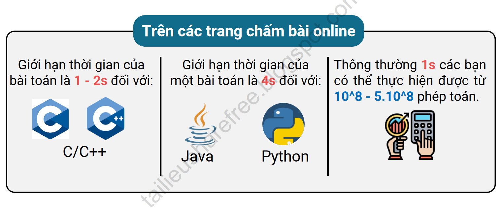

# Độ Phức Tạp Thuật Toán
## Chấm bài trên web

## Một vài độ phức tạp thường gặp
|Thao tác, thuật toán|Độ phức tạp|
|--------------------|-----------|
|Sử dụng công thức toán học để tìm ra ngay lời giải|O(1)|
|Tìm kiếm nhị phân|O(logn)|
|Các thao tác của set, map, hàng đợi ưu tiên|O(logn)|
|Kiểm tra số nguyên tố, phân tích thừa số nguyên tố|O(sqrt(n))|
|Đọc n số từ input|O(n)|
|Duyệt qua mảng|O(n)|
|Hàm sort trong thư viện|O(nlogn)|
|Sàng số nguyên tố|O(nloglogn)|
|Duyệt các tập con cỡ k của tập có n phần tử|O(n^k)|
|Duyệt mọi tập con|O(2^n)|
|Duyệt mọi hoán vị|O(n!)|
